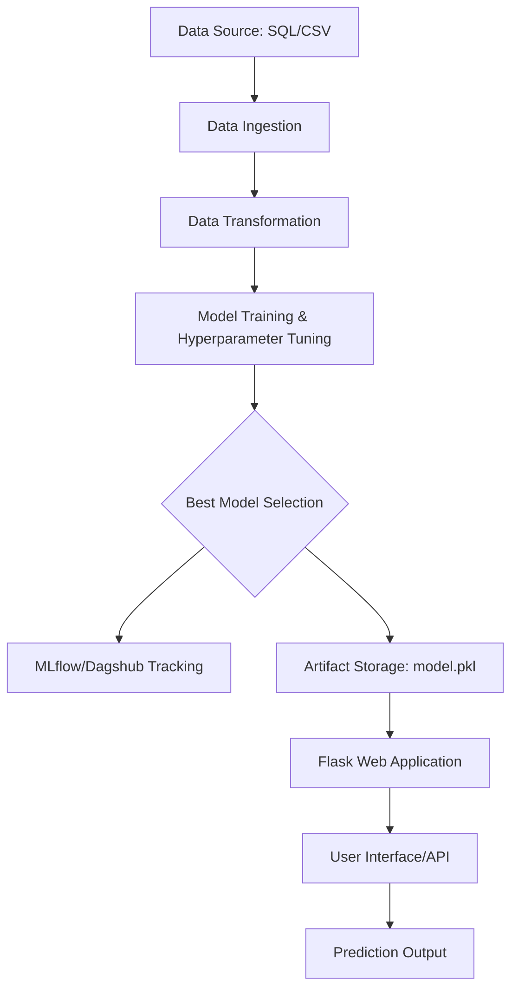

# 🏥 Diabetes Prediction System


An end-to-end Machine Learning solution designed to predict diabetes risk with high precision. This system integrates a robust ML pipeline, automated experiment tracking, and a production-ready web interface, fully containerized for seamless cloud deployment.

---

## 📊 System Architecture



---

## ✨ Key Features

-   **Modular Pipeline**: Highly decoupled architecture for Ingestion, Transformation, and Training.
-   **Advanced Experiment Tracking**: Integrated with **MLflow** and **Dagshub** for logging metrics, parameters, and model artifacts.
-   **Hybrid Data Ingestion**: Supports both local CSV files and remote **MySQL** databases.
-   **Automated Model Selection**: Evaluates multiple algorithms (Random Forest, SVC, KNN, etc.) and selects the top performer via `GridSearchCV`.
-   **Health‑Check Endpoint**: `/health` returns service status for quick monitoring.
-   **Environment‑Driven Configuration**: All thresholds, DB credentials, and Dagshub settings are loaded from a `.env` file using `python-dotenv`.
-   **Reproducibility Seed**: Global `np.random.seed(42)` guarantees deterministic runs.
-   **Full Containerization**: Docker-ready for consistent cross-platform execution.
-   **Cloud Native**: Optimized for **Azure Web App for Containers** with automated CI/CD readiness.
-   **Data Versioning**: Managed via **DVC** to ensure data reproducibility and efficient storage.
-   **Advanced Experiment Tracking**: Integrated with **MLflow** and **Dagshub** for logging metrics, parameters, and model artifacts.
-   **Hybrid Data Ingestion**: Supports both local CSV files and remote **MySQL** databases.
-   **Automated Model Selection**: Evaluates multiple algorithms (Random Forest, SVC, KNN, etc.) and selects the top performer via `GridSearchCV`.
-   **Full Containerization**: Docker-ready for consistent cross-platform execution.
-   **Cloud Native**: Optimized for **Azure Web App for Containers** with automated CI/CD readiness.
-   **Data Versioning**: Managed via **DVC** to ensure data reproducibility and efficient storage.

---

## 📈 Model Performance & Metrics

The system evaluates models using a comprehensive set of metrics to ensure clinical reliability:

| Metric | Description |
| :--- | :--- |
| **Accuracy** | Overall correctness of the model. |
| **Precision** | Reliability of positive (diabetic) predictions. |
| **Recall (Sensitivity)** | Ability to identify all actual diabetic cases. |
| **F1-Score** | Harmonic mean of Precision and Recall. |
| **ROC-AUC** | Model's ability to distinguish between classes. |

*Tracking is automated via MLflow, providing a granular view of every training run.*

---

## 🛠 Tech Stack

| Domain | Tools & Technologies |
| :--- | :--- |
| **Backend** | Python 3.10+, Flask, Gunicorn |
| **Machine Learning** | Scikit-learn, Pandas, NumPy, Joblib |
| **Experiment Tracking** | MLflow, Dagshub |
| **Data Management** | DVC, MySQL, PyMySQL |
| **DevOps** | Docker, Azure Container Registry (ACR), GitHub Actions |
| **Frontend** | HTML5, CSS3, Jinja2 |

---

## 🚀 Getting Started

### Prerequisites
- Python 3.10+
- Docker (optional)
- MySQL (if using database ingestion)

### 1. Installation
```bash
# Clone the repository
git clone https://github.com/harshal3558/Diabetes-Prediction.git
cd Diabetes-Prediction

# Create virtual environment
python -m venv venv
source venv/bin/activate  # Windows: venv\Scripts\activate

# Install dependencies
pip install -r requirements.txt
```

### 2. Environment Setup
Create a `.env` file in the root directory:
```env
host=your_mysql_host
user=your_mysql_user
password=your_mysql_password
db=your_database_name
```

### 3. Run the Application
```bash
# Start the Flask server
python application.py
```
Visit `http://127.0.0.1:5000` to access the prediction portal.

---

## 🐳 Docker Deployment

Run the entire stack in seconds:
```bash
# Build the image
docker build -t diabetes-prediction .

# Run the container
docker run -p 5000:5000 diabetes-prediction
```

---

## 📂 Project Structure

```text
├── artifacts/             # Trained models, preprocessors, and data splits
├── data/                  # Raw and processed datasets
├── src/DIAP/
│   ├── components/        # Ingestion, Transformation, Trainer, Monitoring
│   ├── pipelines/         # Training and Prediction workflow logic
│   ├── logger.py          # Custom logging setup
│   └── exception.py       # Custom error handling
├── templates/             # UI components
├── application.py         # Flask app entry point
├── main.py                # Pipeline execution script
├── Dockerfile             # Container configuration
└── requirements.txt       # Project dependencies
```

---

## 🤝 Contributing

We welcome contributions! Please follow the [Standard GitHub Flow](https://guides.github.com/introduction/flow/) to submit your changes.

1.  Fork the Project
2.  Create your Feature Branch (`git checkout -b feature/AmazingFeature`)
3.  Commit your Changes (`git commit -m 'Add some AmazingFeature'`)
4.  Push to the Branch (`git push origin feature/AmazingFeature`)
5.  Open a Pull Request

---

## 📩 Contact & Support

**Harshal** - [harshal3558@gmail.com](mailto:harshal3558@gmail.com)  
Project Repository: [Diabetes-Prediction](https://github.com/harshal3558/Diabetes-Prediction)

---